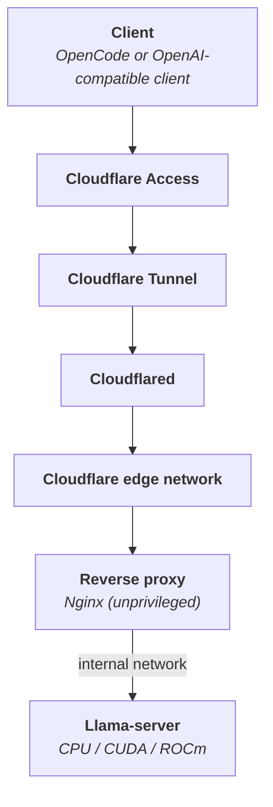

# Llama OpenCode Remote Server

Cross-platform Docker stack for serving any GGUF model through llama.cpp, either fully local or behind an unprivileged Nginx reverse proxy, Cloudflare Tunnel and Cloudflare Access.

## Compatibility

| Backend     | Linux | Windows      | macOS       |
| ----------- | ----- | ------------ | ----------- |
| CPU         | ✅    | ✅           | ✅          |
| NVIDIA CUDA | ✅    | ✅ ***\****  | ❌          |
| AMD ROCm    | ✅    | ❌           | ❌          |

- ***\**** Required usage of WSL2.

## Prerequisites

- [Docker](https://www.docker.com)
- [Bun](https://bun.sh/)
- [Cloudflare Tunnel](https://developers.cloudflare.com/cloudflare-one/connections/connect-networks/) - only for the remote mode
- [Hugging Face CLI](https://huggingface.co/docs/huggingface_hub/guides/cli) - only for `--hf-repository`

## Architecture



## Installation

### 1. Install dependencies

Install the required packages.

```bash
bun install
```

> You can also use `sfw bun install`.

### 2. Configure the environment

Copy the example environment file and edit it as needed.

```bash
cp .env.example .env
```

### 3. Initialize the stack

Choose a backend and exactly one model source. Add `--local` to skip the Cloudflare Tunnel token prompt when you only intend to run locally.

#### Local GGUF file

Use a GGUF model already available on the host.

```bash
bun run stack init \
    --backend [cpu|nvidia|amd] \
    --model-file [MODEL_FILE]
```

#### Direct download

Download a GGUF model from a direct URL.

```bash
bun run stack init \
    --backend [cpu|nvidia|amd] \
    --model-url [MODEL_URL] \
    --model-directory [MODEL_DIRECTORY]
```

`--model-directory` is optional and defaults to `$HOME/.llama/models`.

#### Hugging Face

Download a model from a Hugging Face repository.

```bash
bun run stack init \
    --backend [cpu|nvidia|amd] \
    --hf-repository [HUGGING_FACE_REPOSITORY] \
    --hf-include "*.gguf"
```

### 4. Run the preflight checks

Verify that the host, selected backend, and model are ready.

```bash
bun run stack preflight
```

> Use `bun run stack preflight --local` for a local-only stack: the Cloudflare Tunnel token is then not required.

### 5. Start the stack

#### Remote mode

Start the full stack with remote access enabled.

```bash
bun run stack up
```

#### Local-only mode

Run llama.cpp locally without the reverse proxy or Cloudflare Tunnel.

```bash
bun run stack up --local
```

## Usage

| Command      | Description                                                 |
| ------------ | ----------------------------------------------------------- |
| `init`       | Resolve the model source, then write `.env` and the secrets |
| `preflight`  | Check Docker, the model, the secrets and the Compose files  |
| `pull`       | Pull the container images                                   |
| `up`         | Start the stack                                             |
| `down`       | Stop and remove the stack containers                        |
| `restart`    | Restart the stack                                           |
| `status`     | Show container status                                       |
| `logs`       | Follow the llama.cpp logs                                   |
| `test`       | Send a chat completion to the loopback port                 |
| `rotate-key` | Generate and apply a new API key                            |
