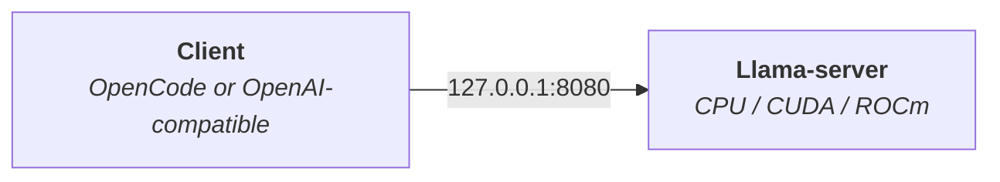
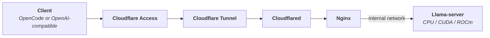

# Llama OpenCode Remote Server

Cross-platform Docker stack for serving any GGUF model through llama.cpp.

## Table of contents

- [Llama OpenCode Remote Server](#llama-opencode-remote-server)
  - [Table of contents](#table-of-contents)
  - [Compatibility](#compatibility)
  - [Prerequisites](#prerequisites)
  - [Architecture](#architecture)
    - [Local](#local)
    - [Remote](#remote)
  - [Setup](#setup)
  - [Local setup](#local-setup)
    - [1. Initialize](#1-initialize)
    - [2. Check](#2-check)
    - [3. Start](#3-start)
    - [4. Configure the client](#4-configure-the-client)
    - [5. Test](#5-test)
  - [Remote setup](#remote-setup)
    - [1. Create the tunnel](#1-create-the-tunnel)
    - [2. Publish the hostname](#2-publish-the-hostname)
    - [3. Initialize](#3-initialize)
    - [4. Check](#4-check)
    - [5. Start](#5-start)
    - [6. Create a service token](#6-create-a-service-token)
    - [7. Configure Access](#7-configure-access)
    - [8. Configure the client](#8-configure-the-client)
    - [9. Test](#9-test)
  - [Commands](#commands)
  - [Client machines](#client-machines)
  - [Custom Compose file](#custom-compose-file)
  - [Heartbeat](#heartbeat)
  - [Troubleshooting](#troubleshooting)

## Compatibility

| Backend     | Linux  | Windows     | macOS  |
| ----------- | ------ | ----------- | ------ |
| CPU         | ✅     | ✅          | ✅     |
| NVIDIA CUDA | ✅     | ✅ via WSL2 | ❌     |
| AMD ROCm    | ✅     | ❌          | ❌     |

## Prerequisites

- [Docker](https://www.docker.com)
- [Bun](https://bun.sh/)
- [Cloudflare Tunnel](https://developers.cloudflare.com/cloudflare-one/networks/connectors/cloudflare-tunnel/) — remote only
- [Hugging Face CLI](https://huggingface.co/docs/huggingface_hub/guides/cli) — only with `--hf-repository`

## Architecture

### Local



### Remote



## Setup

Install dependencies:

```bash
bun install
```

> You can also use `sfw bun install`.

Copy the environment file:

```bash
cp .env.example .env
```

Choose one model source when running `stack init`:

| Source       | Arguments                                                     |
| ------------ | ------------------------------------------------------------- |
| Local GGUF   | `--model-file [MODEL_FILE]`                                   |
| Direct URL   | `--model-url [MODEL_URL] --model-directory [MODEL_DIRECTORY]` |
| Hugging Face | `--hf-repository [REPOSITORY] --hf-include [GGUF_FILE]`       |

`--model-directory` defaults to `$HOME/.llama/models`.

## Local setup

Use local mode when the server only needs to be accessible from the host.

### 1. Initialize

```bash
bun run stack init \
    --local \
    --backend [cpu|nvidia|amd] \
    [MODEL_SOURCE]
```

### 2. Check

```bash
bun run stack preflight --local
```

### 3. Start

```bash
bun run stack up --local
```

### 4. Configure the client

```bash
cp clients/client.env.example clients/client.env
```

```env
LLAMA_BASE_URL=http://127.0.0.1:8080
LLAMA_API_KEY=[API_KEY]
CLOUDFLARE_ACCESS_CLIENT_ID=
CLOUDFLARE_ACCESS_CLIENT_SECRET=
```

The API key is stored in:

```text
secrets/.llama_api_key
```

Start OpenCode:

```bash
set -a; source clients/client.env; set +a
OPENCODE_CONFIG="$PWD/clients/opencode.remote.json" opencode
```

### 5. Test

```bash
bun run stack test
```

## Remote setup

Use remote mode to expose the server through Cloudflare.

### 1. Create the tunnel

In Cloudflare: `Networking` → `Tunnels` → `Create a tunnel` → `Cloudflared`.  
Create the tunnel and copy only the value passed to `--token`.

### 2. Publish the hostname

`Routes` → `Add route` → `Published application`

| Field       | Value               |
| ----------- | ------------------- |
| Subdomain   | e.g. `llm`          |
| Domain      | your domain         |
| Service URL | `http://proxy:8080` |

> Do not expose `llama:8080` directly.

### 3. Initialize

```bash
bun run stack init \
    --backend [cpu|nvidia|amd] \
    [MODEL_SOURCE]
```

The tunnel token is stored in:

```text
secrets/.cloudflare_tunnel_token
```

### 4. Check

```bash
bun run stack preflight
```

### 5. Start

```bash
bun run stack up
```

### 6. Create a service token

In Cloudflare Zero Trust: `Access controls` → `Service credentials` → `Service Tokens` → `Create Service Token`.  
Generate the token and copy:

- Client ID
- Client Secret

### 7. Configure Access

`Access controls` → `Applications` → `Create new application` → `Self-hosted and private`

Add the hostname created earlier and attach:

| Field    | Value           |
| -------- | --------------- |
| Action   | `Service Auth`  |
| Selector | `Service Token` |

### 8. Configure the client

```bash
cp clients/client.env.example clients/client.env
```

```env
LLAMA_BASE_URL=https://llm.example.com
LLAMA_API_KEY=[API_KEY]
CLOUDFLARE_ACCESS_CLIENT_ID=[CLIENT_ID]
CLOUDFLARE_ACCESS_CLIENT_SECRET=[CLIENT_SECRET]
```

The API key is stored in:

```text
secrets/.llama_api_key
```

Start OpenCode:

```bash
set -a; source clients/client.env; set +a
OPENCODE_CONFIG="$PWD/clients/opencode.remote.json" opencode
```

### 9. Test

```bash
bun run stack test
```

## Commands

| Command      | Description                                                     |
| ------------ | --------------------------------------------------------------- |
| `init`       | Configure the backend, model and secrets (`--force` to overwrite) |
| `preflight`  | Validate the stack                                              |
| `pull`       | Pull container images                                           |
| `up`         | Start the stack                                                 |
| `down`       | Stop the stack                                                  |
| `restart`    | Restart the stack                                               |
| `status`     | State and health of every service (`--json` for raw Compose JSON) |
| `logs`       | Follow one service (`--service llama\|heartbeat\|proxy\|cloudflared`) |
| `test`       | Send a chat completion with `clients/client.env`                |
| `health`     | One-token completion proving the server answers and the key works |
| `models`     | Local `.gguf` files, or what the server serves on a client host  |
| `doctor`     | Every check with a suggested fix (`--client`, `--json`)          |
| `rotate-key` | Rotate the API key, restart llama.cpp and wait for it to be healthy |
| `uninstall`  | Stop everything, then offer to remove `.env` and `secrets/`      |

Every Compose-driving command takes `--backend`, `--local` and
`--compose-file`.

## Client machines

`test`, `health`, `models` and `doctor --client` only need
`clients/client.env`: no `.env`, no Docker, no model and no secret on that
machine. Clone the repository, run `bun install`, fill in `clients/client.env`
and check the endpoint the same way the server host does:

```bash
bun run stack doctor --client
bun run stack health
bun run stack models
```

`models` lists the local `.gguf` files when `.env` points at a model
directory, and falls back to the `/v1/models` answer of the configured
endpoint otherwise.

## Custom Compose file

A machine-specific Compose file is layered last, so it overrides everything the
repository ships:

```bash
bun run stack up --compose-file docker/docker-compose.rig.yaml
```

Set `COMPOSE_OVERRIDE_FILE` in `.env` to apply it to every command without
passing the flag. The variable is deliberately not called `COMPOSE_FILE`:
Docker Compose reads that one itself and would replace the whole file set.

## Heartbeat

The `heartbeat` service is a small Bun-compiled binary
(`docker/heartbeat.Dockerfile`) that polls `http://llama:8080/health` on the
internal network. It exists because the llama.cpp images cannot be relied on
for a container healthcheck: several of them ship without an HTTP client, and
some published tags lag upstream.

It logs one logfmt line per event — startup, the llama.cpp build it found
through `/props`, and every transition between healthy and unhealthy:

```bash
bun run stack logs --service heartbeat
```

Its healthcheck (`heartbeat check`, one probe then an exit code) is what the
reverse proxy waits on before starting, and what `rotate-key` polls after
restarting llama.cpp. Tune it with `HEARTBEAT_INTERVAL_MS` and
`HEARTBEAT_TIMEOUT_MS` in `.env`.

## Troubleshooting

| Symptom                                                    | Likely cause                   | Fix                                                                 |
| ---------------------------------------------------------- | ------------------------------ | ------------------------------------------------------------------- |
| `Docker is not installed or the daemon is not running.`     | Docker Desktop stopped         | Start Docker, then `bun run stack doctor`.                          |
| `Model file not found`                                     | model missing or moved         | Re-run `init`, or copy the `.gguf` into `MODEL_DIRECTORY`.           |
| `Missing secrets/...`                                      | secrets wiped                  | Re-run `init`.                                                       |
| `... rejected the API key (401/403)`                        | wrong key or Access token      | Check `LLAMA_API_KEY` and the Access token in `clients/client.env`.  |
| `... did not answer`                                        | stack down, or wrong base URL  | `bun run stack up`, then verify `LLAMA_BASE_URL`.                    |
| `llama.cpp is not healthy after the restart`                | model still loading            | Watch `bun run stack logs --service heartbeat`, then `status`.       |
| `AMD ROCm ... / NVIDIA CUDA ...`                            | unsupported host               | Use `--backend cpu` on that machine.                                 |
| `Run \`init\` first: .env is missing ...`                     | server command on a client host | Use the client commands, or run `init` on the server.               |

`bun run stack doctor` prints all of the above at once, each failing line with
the fix that clears it.
