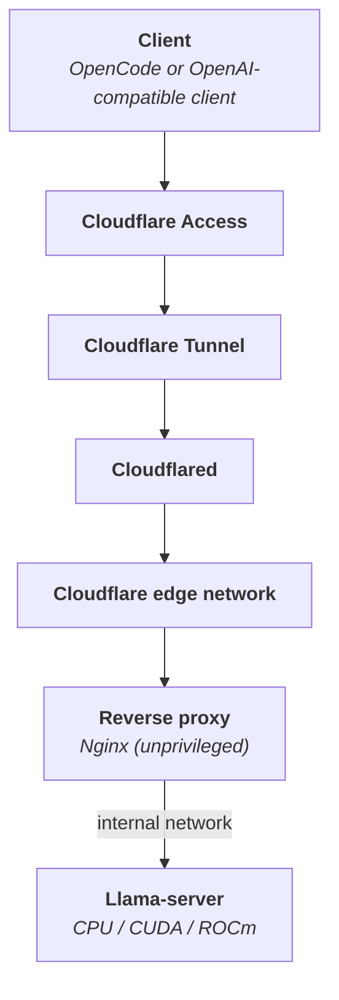

# Llama OpenCode Remote Server

Cross-platform Docker stack for serving any GGUF model through llama.cpp, either fully local or behind an unprivileged Nginx reverse proxy, Cloudflare Tunnel and Cloudflare Access.

## Table of contents

- [Compatibility](#compatibility)
- [Prerequisites](#prerequisites)
- [Architecture](#architecture)
- [Installation](#installation)
  - [1. Install dependencies](#1-install-dependencies)
  - [2. Configure the environment](#2-configure-the-environment)
  - [3. Initialize the stack](#3-initialize-the-stack)
  - [4. Run the preflight checks](#4-run-the-preflight-checks)
  - [5. Start the stack](#5-start-the-stack)
- [Usage](#usage)
- [Cloudflare setup](#cloudflare-setup)
  - [1. Create the tunnel](#1-create-the-tunnel)
  - [2. Publish the hostname](#2-publish-the-hostname)
  - [3. Store the tunnel token](#3-store-the-tunnel-token)
  - [4. Create a service token](#4-create-a-service-token)
  - [5. Protect the hostname with Access](#5-protect-the-hostname-with-access)
  - [6. Configure the client](#6-configure-the-client)
  - [7. Verify](#7-verify)

## Compatibility

| Backend     | Linux | Windows      | macOS       |
| ----------- | ----- | ------------ | ----------- |
| CPU         | ✅    | ✅           | ✅          |
| NVIDIA CUDA | ✅    | ✅ ***\****  | ❌          |
| AMD ROCm    | ✅    | ❌           | ❌          |

- ***\**** Required usage of WSL2.

## Prerequisites

- [Docker](https://www.docker.com)
- [Bun](https://bun.sh/)
- [Cloudflare Tunnel](https://developers.cloudflare.com/cloudflare-one/networks/connectors/cloudflare-tunnel/) - only for the remote mode
- [Hugging Face CLI](https://huggingface.co/docs/huggingface_hub/guides/cli) - only for `--hf-repository`

## Architecture



## Installation

### 1. Install dependencies

Install the required packages.

```bash
bun install
```

> You can also use `sfw bun install`.

### 2. Configure the environment

Copy the example environment file and edit it as needed.

```bash
cp .env.example .env
```

### 3. Initialize the stack

Choose a backend and exactly one model source. Add `--local` to skip the Cloudflare Tunnel token prompt when you only intend to run locally.

#### Local GGUF file

Use a GGUF model already available on the host.

```bash
bun run stack init \
    --backend [cpu|nvidia|amd] \
    --model-file [MODEL_FILE]
```

#### Direct download

Download a GGUF model from a direct URL.

```bash
bun run stack init \
    --backend [cpu|nvidia|amd] \
    --model-url [MODEL_URL] \
    --model-directory [MODEL_DIRECTORY]
```

`--model-directory` is optional and defaults to `$HOME/.llama/models`.

#### Hugging Face

Download a model from a Hugging Face repository.

```bash
bun run stack init \
    --backend [cpu|nvidia|amd] \
    --hf-repository [HUGGING_FACE_REPOSITORY] \
    --hf-include [GGUF_FILE]
```

### 4. Run the preflight checks

Verify that the host, selected backend, and model are ready.

```bash
bun run stack preflight
```

> Use `bun run stack preflight --local` for a local-only stack: the Cloudflare Tunnel token is then not required.

### 5. Start the stack

#### Remote mode

Start the full stack with remote access enabled.

```bash
bun run stack up
```

#### Local-only mode

Run llama.cpp locally without the reverse proxy or Cloudflare Tunnel.

```bash
bun run stack up --local
```

## Usage

| Command      | Description                                                 |
| ------------ | ----------------------------------------------------------- |
| `init`       | Resolve the model source, then write `.env` and the secrets |
| `preflight`  | Check Docker, the model, the secrets and the Compose files  |
| `pull`       | Pull the container images                                   |
| `up`         | Start the stack                                             |
| `down`       | Stop and remove the stack containers                        |
| `restart`    | Restart the stack                                           |
| `status`     | Show container status                                       |
| `logs`       | Follow the llama.cpp logs                                   |
| `test`       | Send a chat completion to the loopback port                 |
| `rotate-key` | Generate and apply a new API key                            |

## Cloudflare setup

### 1. Create the tunnel

`Networking` → `Tunnels` → `Create a tunnel` → `Cloudflared`, name it, then `Create tunnel`. The next screen shows an install command: copy only the value passed to `--token`, the `cloudflared` container of this stack runs the connector itself.

### 2. Publish the hostname

On the tunnel, `Routes` tab → `Add route` → `Published application`:

| Field         | Value                |
| ------------- | -------------------- |
| Subdomain     | e.g.: `llm`          |
| Domain        | your domain          |
| Service URL   | `http://proxy:8080`  |

`proxy:8080` is the Nginx container, reachable by name because `cloudflared` and `proxy` share the `edge` Docker network. Never publish `llama:8080` directly: it sits on the `internal` network and has no rate limiting.

### 3. Store the tunnel token

The token is written to `secrets/cloudflare_tunnel_token.txt`, either through the `bun run stack init` prompt or from the environment.

```bash
bun run stack init --backend cpu --model-file [MODEL_FILE]
```

### 4. Create a service token

`Zero Trust` → `Access controls` → `Service credentials` → `Service Tokens` → `Create Service Token`. Pick a `Service Token Duration`, then `Generate token`. The client secret is displayed once, copy both values immediately.

Service tokens now expire. Renew before the expiry date with `Refresh` (extends by one year) or `Edit` → new duration. An expired token turns every request into an Access login page.

### 5. Protect the hostname with Access

`Zero Trust` → `Access controls` → `Applications` → `Create new application` → `Self-hosted and private` → `Add public hostname`, using the hostname of step 2. Attach a policy:

| Field    | Value                                          |
| -------- | ---------------------------------------------- |
| Action   | `Service Auth`                                 |
| Selector | `Service Token` (the one created in step 4)    |

`Service Auth` skips the identity provider login flow, which an API client cannot complete. Applications are deny by default, so this policy is what lets the client through. Policies are now reusable: create it once from `Access controls` → `Policies` and attach it to the application, legacy app-scoped policies cannot be added to new applications.

### 6. Configure the client

```bash
cp clients/client.env.example clients/client.env
```

| Variable                          | Value                              |
| --------------------------------- | ---------------------------------- |
| `LLAMA_BASE_URL`                  | `https://llm.example.com`          |
| `LLAMA_API_KEY`                   | printed by `bun run stack init`    |
| `CLOUDFLARE_ACCESS_CLIENT_ID`     | service token client ID            |
| `CLOUDFLARE_ACCESS_CLIENT_SECRET` | service token client secret        |

Then start OpenCode with the remote profile.

```bash
set -a; source clients/client.env; set +a
OPENCODE_CONFIG="$PWD/clients/opencode.remote.json" opencode
```

### 7. Verify

```bash
curl -sS https://llm.example.com/v1/chat/completions \
    -H "Authorization: Bearer $LLAMA_API_KEY" \
    -H "CF-Access-Client-Id: $CLOUDFLARE_ACCESS_CLIENT_ID" \
    -H "CF-Access-Client-Secret: $CLOUDFLARE_ACCESS_CLIENT_SECRET" \
    -H "Content-Type: application/json" \
    -d '{"messages":[{"role":"user","content":"ping"}]}'
```
